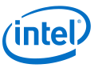

Title: Our partners

LHCb is an experiment set up to explore what happened after the Big Bang that allowed matter to survive and build the Universe we inhabit today.

The Yandex School of Data Analysis (YSDA) is a free Master’s-level program in Computer Science and Data Analysis, which is offered by Yandex since 2007. The aim of the School is to train specialists in data analysis and information retrieval to be able to solve cutting edge industry problems as well as fundamental research challenges. YSDA is associated member of LHCb since December 2014.

Yandex Data Factory are the Machine Learning and data analytics experts that use data science to improve business’ operations, revenues and profitability. By building upon the real-time personalisation and predictive analytics technology of parent company, Yandex, the fourth largest search engine in the world, Yandex Data Factory helps clients improve their business awareness through the exploitation of their own data.

Yandex Data Factory’s proven data science and technology continually analyses, tests, refines and reapplies hundreds of hypotheses to the customers’ datasets to determine the best next course of action. It offers tailored, scalable, SaaS-driven Machine Learning services to a wide variety of data-reliant verticals, such as retail, financial services, travel and telecoms, who wish to use their data for purposes such as improving personalisation, segmentation, churn prevention or fraud detection.

Yandex Data Factory was founded in 2014 by Yandex and is headquartered in Amsterdam, operating throughout Europe.

Intel (NASDAQ: INTC) is a world leader in computing innovation. The company designs and builds the essential technologies that serve as the foundation for the world’s computing devices. As a leader in corporate responsibility and sustainability, Intel also manufactures the world’s first commercially available “conflict-free” microprocessors. Additional information about Intel is available at [http://newsroom.intel.com](http://newsroom.intel.com) and [http://blogs.intel.com](http://blogs.intel.com).

The University of Zurich is one of the leading research universities in Europe and offers the widest range of degree programs in Switzerland. It was founded in 1833 and currently has seven faculties: Philosophy, Human Medicine, Economic Sciences, Law, Mathematics and Natural Sciences, Theology and Veterinary Medicine. 

Warwick is one of the UK's leading universities, with an acknowledged reputation for excellence in research and teaching, for innovation, and for links with business and industry.

Institute of Nuclear Physics, Polish Academy of Sciences. Founded in 1955 Institute of Nuclear Physics has become leading Particle Physics research institution and ranked as class A+ by Polish Ministry of Higher Education.

Consistently ranked as one of Russia’s top universities, the Higher School of Economics is a leader in Russian education and one of the preeminent economics and social sciences universities in eastern Europe and Eurasia.  

